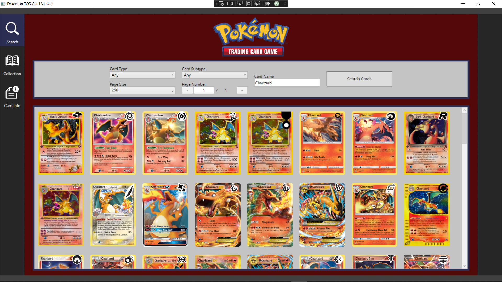
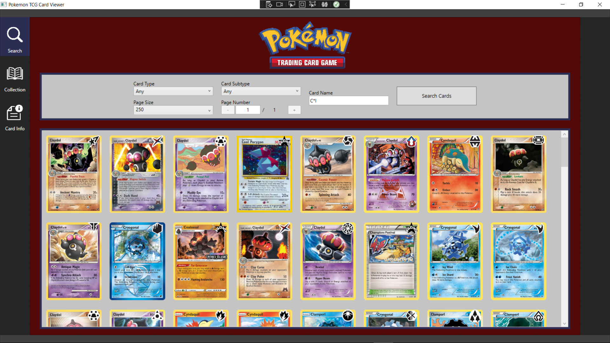
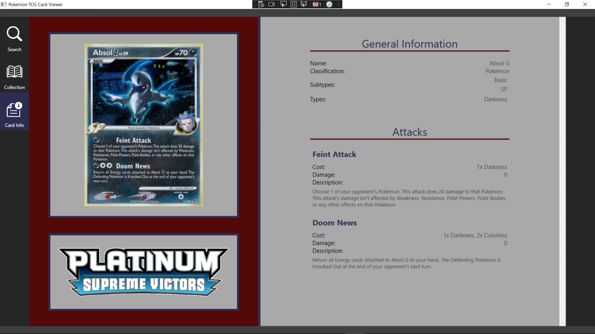

# Pokemon TCG Card Viewer

## Introduction
Games often have dozens if not hundreds of items the player can collect and use. In such a case it can be very useful to be able to view the item stats so the player knows if the item is worth collecting. Moreso, having a list of all the items and their stats currently in the game is also useful during development of said game. That is why I decided to use the Pokemon TCG API for this project, as it is a card game with thousands of cards. This means that the need for a central application to view the different cards available is very high for both the developer of the computer game and the player.

## Overview Page
The overview page gives you access to a search area where you can set the following search queries:
- Card Type (e.g. Colorless)
- Card Subtype (e.g. Stage 1)
- Page Size
- Page Number
- Name (e.g. Charizard or Char*)

The name field can contain the exact card name, but can also have a wildcard character (*). The wildcard character will match with any number of characters, and can be anywhere within the name. If you search for "C\*", it will look for any card name starting with the letter 'C'. 

## Detail Page
The detail page will give you more info on the card's stats, such as the classification. If the card has it, the attacks, abilities and rules will also be displayed.
The card series logo is displayed under the card.

## Switching Repository
The repository can easily be switched via the UI: Simply select the "Search" icon in the left sidebar to use the API repository and the "Collection" icon to use the local repository.

## Sources
- API main page: https://pokemontcg.io/
- Documentation for the API: https://docs.pokemontcg.io/